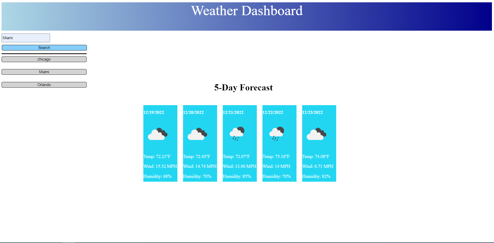

# Weather App

This app will tell the user the weather for the next few days of the city the user chooses
The App will also record the city the user inputs, save it on local storage, and make it so a button is created. The button will pull up info of city clicked 

Could not get Current weather to show, would get 401 error on API call, accepetd the loss 

https://manuelc0159.github.io/Challenge06/

